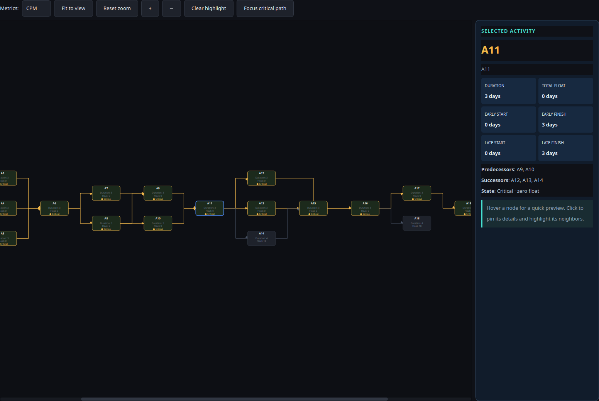
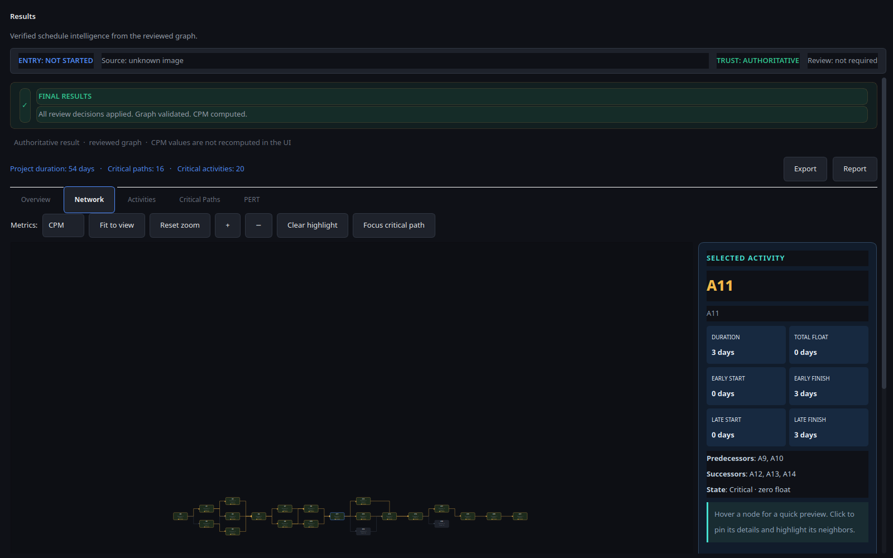

# Phase 18B — Network Implementation

## Status

**Implemented and visually verified.** The Results Network tab now presents the reviewed graph as a deterministic layered DAG with orthogonal dependency routing, a selected-activity Inspector, and a transient hover preview.

## Scope delivered

- Added `build_layered_layout()` in `pert_analyzer/gui/results/layout.py`.
  - Uses deterministic Kahn topological ordering.
  - Assigns logical levels from longest predecessor depth.
  - Places siblings around predecessor anchors to preserve local fan-out and merge points.
  - Does not mutate the backend graph or infer new relationships.
- Replaced diagonal dependency rendering with orthogonal stepped paths and directed arrowheads.
- Added a right-side **Selected Activity Inspector** showing:
  - Duration
  - Total float
  - Early start / finish
  - Late start / finish
  - Predecessors and successors
  - Critical or non-critical state
- Added a glass-style hover preview containing the same four timing values, float, and critical membership.
- Preserved CPM/PERT metric switching and backend-provided critical-edge highlighting.
- Added an initial readable view for long networks. The toolbar's **Fit to view** action remains available for full-graph framing; the initial state avoids rendering a long DAG as unreadable miniatures.

## Data-integrity contract

The Network view remains a read-only projection of `ResultsData`:

- Activity timing values come from the extracted `ActivityRow` / backend CPM analysis.
- Relationships come from the backend graph dependencies.
- Critical edges come from `ResultsData.critical_edges` or PERT critical paths.
- No CPM/PERT calculations, path enumeration, confidence changes, or relationship recovery are performed in the UI.
- Missing values remain explicitly unavailable rather than being invented.

## Reference verification

The real reference fixture contains **22 activities, 28 dependencies, 54 days, and 16 critical paths**. The rendered verification captured all **22 nodes** and **28 edges**, with activity `A11` selected in the Inspector.



The full Results shell capture is also retained:



## Test evidence

Focused validation completed:

```text
50 passed — tests/gui/test_results_network.py tests/gui/test_results_dashboard.py
71 passed — tests/gui/test_results_network.py tests/gui/test_network_builder.py
```

The broader GUI batch also reached `142 passed`; its process then exited with Qt teardown status 139 only when multiple GUI suites shared the session. The issue was isolated: the Network + Network Builder pair and the Results dashboard suite individually terminate cleanly, and the Phase 18B focused suites pass without the teardown crash.

## Acceptance notes

- The graph is a real layered network, not a single-line river.
- Gold is reserved for critical structure; cyan identifies the selected node/route.
- Orthogonal edges make branching and merging legible.
- The Inspector provides detail without duplicating the Activities table inside the Network canvas.
- The visual shell remains compatible with both Results entry modes; the readiness/provenance banner remains authoritative and is not recomputed by the view.

## Next phase

Phase 18C should refine interaction feedback and cross-tab navigation, especially hover positioning near viewport boundaries, focus-path behavior, and keyboard/accessibility affordances. The remaining Results tabs can then be brought into the same technical visual system without duplicating authoritative data.
